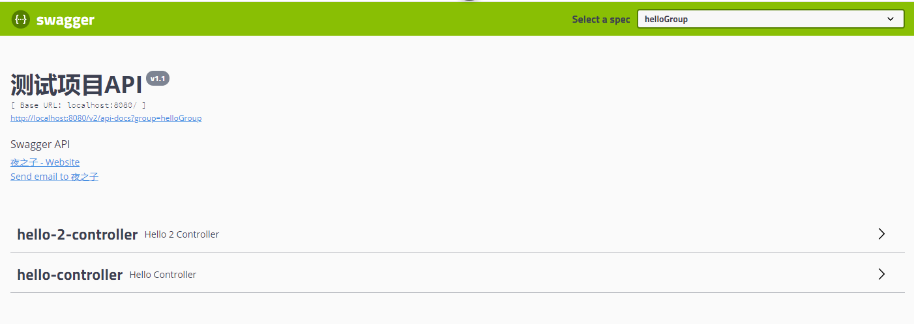

# swagger-ext

Swagger扩展工具，支持API分组


## Usage

- Dependence

```
<dependency>
     <groupId>cn.chenzw.swagger</groupId>
     <artifactId>swagger-ext-core</artifactId>
     <version>1.0.0</version>
</dependency>
```

- 开启API分组功能

```
@Configuration
@EnableSwagger2
@EnableSwaggerGroup
public class SwaggerConfig {

}
```

- 使用@ApiGroup注解分组
  - @ApiGroup的name值相同的为一组
```
@ApiGroup(name = "helloGroup")
@RestController
@RequestMapping("/hello")
public class HelloController {

    @GetMapping("/say")
    public String say(String name) {
        return "hello, " + name;
    }
}

@ApiGroup(name = "helloGroup")
@RestController
@RequestMapping("/hello2")
public class Hello2Controller {

    @GetMapping("/say")
    public String say(String name) {
        return "hello, " + name;
    }
}

```

- 效果



- 配置(可选)

```
# swagger.scan-basepackage必选,其它选项可选
swagger.scan-basepackage=cn.chenzw.swagger.ext.samples
swagger.title=测试项目API
swagger.description=Swagger API
swagger.term-of-service-url=
swagger.version=v1.1
swagger.contact.name=夜之子
swagger.contact.url=https://github.com/otary/swagger-ext
swagger.contact.email=656469722@qq.com
```

