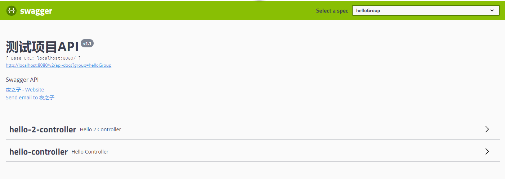

# swagger-ext

Swagger扩展工具，支持API分组


[](https://www.codacy.com/manual/otary/sms-integration?utm_source=github.com&amp;utm_medium=referral&amp;utm_content=otary/sms-integration&amp;utm_campaign=Badge_Grade)
[](https://travis-ci.org/otary/swagger-ext)


## Features

- [x] 支持API分组显示
- [x] 支持Map、JSONObject等参数、响应值的API


## Usage

- Dependence

```
<dependency>
     <groupId>cn.chenzw.swagger</groupId>
     <artifactId>swagger-ext-core</artifactId>
     <version>1.0.0</version>
</dependency>
```

### 开启API分组功能

```
@Configuration
@EnableSwagger2
@EnableSwaggerGroup
public class SwaggerConfig {

}
```

- 使用@ApiGroup注解分组
  - @ApiGroup的name值相同的为一组
```
@ApiGroup(name = "helloGroup")
@RestController
@RequestMapping("/hello")
public class HelloController {

    @GetMapping("/say")
    public String say(String name) {
        return "hello, " + name;
    }
}

@ApiGroup(name = "helloGroup")
@RestController
@RequestMapping("/hello2")
public class Hello2Controller {

    @GetMapping("/say")
    public String say(String name) {
        return "hello, " + name;
    }
}

```

- 效果



- 配置(可选)

```
# swagger.scan-basepackage必选,其它选项可选
swagger.scan-basepackage=cn.chenzw.swagger.ext.samples
swagger.title=测试项目API
swagger.description=Swagger API
swagger.term-of-service-url=
swagger.version=v1.1
swagger.contact.name=夜之子
swagger.contact.url=https://github.com/otary/swagger-ext
swagger.contact.email=656469722@qq.com
```

- 访问

http://localhost:8080/swagger-ui.html#/


### 开启支持Map、JSONObject参数、返回值


```
@Configuration
@EnableSwagger2
@EnableSwaggerExt
public class SwaggerConfig {

    /**
     * 默认API分组
     *
     * @return
     */
    @Bean
    public Docket api() {
        return new Docket(DocumentationType.SWAGGER_2)
                .select()
                .apis(RequestHandlerSelectors.basePackage("cn.chenzw.swagger.ext.springboot"))
                .paths(PathSelectors.any())
                .build();
    }
}
```

- 使用@ApiMapParams、 @ApiMapResponses定义Map、JSONObject等参数、响应值

```
@RestController
@RequestMapping("/home")
public class HomeController {

    @ApiMapResponses({
            @ApiMapResponse(key = "resp1", description = "响应值1", allowableValues = "1,2,3"),
            @ApiMapResponse(key = "resp2", description = "响应值2")
    })
    @ApiMapParams(name = "map2", value = {
            @ApiMapParam(key = "test", description = "测试", allowableValues = "1,2,3"),
            @ApiMapParam(key = "test2", description = "测试2")
    })
    @PostMapping("/map2")
    public Map<String, Object> testMapWidthMethodAnnotation(@RequestBody Map<String, Object> map2) {
        return map2;
    }


}
```

### 发布

> mvn clean deploy -Dmaven.test.skip=true -P oss-release